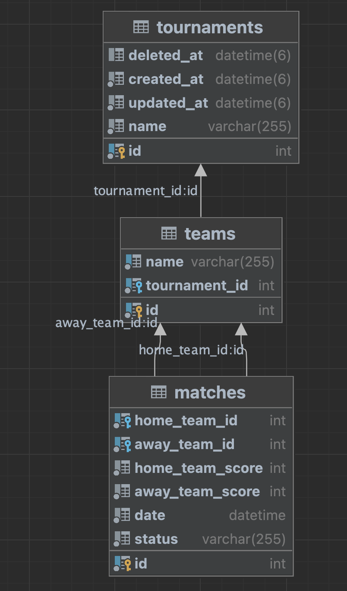

# Football Tournament APIs
## Database

## How to run locally
0. Create database: create a database named `hometest` or any one you like
1. Create `.env` file. Copy example value from `.env.example` file and change values
2. `yarn install`
3. Migrate tables and data: `yarn migrate:up`
4. Build source: `yarn build`
5. Start server: `yarn start:prod`

## API document
After start server then access: http://localhost:3000/api
Note: 3000 is the port you set in .env file

## Live version
1. Backend api: http://128.199.165.172:3000
2. API Document: http://128.199.165.172:3000/api